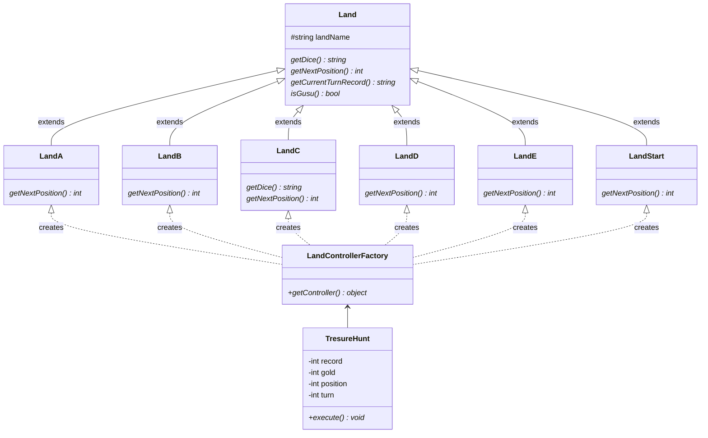

# TreasureHunt/TreasureHuntModify
`TresureHunt` テストデータとして固定のサイコロ出目の文字列を入力値とします  
`TreasureHuntModify` ランダムなターン数[10-100]、およびサイコロの出目[1-6]を入力値とします

共通で下記のパラメータを持ちます。
- position 現在地（スタート、A島、B島、C島、D島、E島、ゴールのいづれか）
- record   記録（現在地とサイコロの出目をカンマ区切りで追記されていく）
- gold     所持ゴールド
- turn     ターン数

ターン毎に現在地の島クラスに対応した行動を繰り返しながら、  
最終ターンを終了する、またはゴールへ到着するまでのターン数、記録、所持ゴールドを出力します

# Class Diagram

各種の島クラスは、`Land` クラスを継承して下記の共通処理を実施します
- `getDice()` サイコロの出目の取得
- `getCurrentTurnRecord()` 記録の追記
- `isGusu()` サイコロの出目の偶数判定

各種の島クラスは、下記の同名クラスで島クラス毎に異なる処理を実施します
- `getDice()` サイコロ2回分の出目の取得（C島クラスのみ）
- `getNextPosition()` 次ターンの現在地を取得

`TresureHunt` クラスは、`LandControllerFactory` クラスを介して、現在地に対応した島クラスのインスタンスを取得します  
その後、取得したインスタンスを利用して現在地毎の処理を実施します  
その為、`TresureHunt` クラスは取得したインスタンスの具体的な島クラスを意識する必要はないので両者に依存関係はありません

これは今後の拡張として、容易に島クラスの追加が対応可能となります  
F島クラスを追加する場合、具体的な影響箇所は `LandControllerFactory` クラスと `Land` クラスのみとなります

```php
class LandControllerFactory
{
    static public function getController($position){
        switch ($position) {
            case Land::LandA :
...
            case Land::LandE :
                return new LandE('E');
            ======= ADD CODE ========
            case Land::LandF :
                return new LandF('F');
            ======= ADD CODE ========
            default :
                return new LandStart('S');
        }
    }
}

class Land
{
    protected $landName; //島名

    const LandStart = 0;
...
    const LandE = 5;
    ======= ADD CODE ========
    const LandF = 6;
    ======= ADD CODE ========
    ...
}
class LandF extends Land
{
    function getNextPosition($dice, &$gold): int
    { ... }
}
```

# Procedures
1. `TresureHunt` クラスは、`LandControllerFactory` にターン毎の現在地 `position` を渡します
2. `LandControllerFactory` クラスは、現在地に対応した島クラスのインスタンスを生成して返します
3. 島クラスのインスタンスは、サイコロの出目を取得して、現在地とサイコロの出目を記録 `record` に追記します
4. 島クラスのインスタンスは、現在地に対応した島クラスでのサイコロの出目と所持ゴールドに応じた次ターンの現在地を取得します
5. 最終ターンを終了する、またはゴールに到着するまで 処理[1-4]を繰り返す

# PHPUnit
```
$ phpunit stackTest.php
PHPUnit 9.5.19 #StandWithUkraine

.                                                                   1 / 1 (100%)

Time: 00:00.001, Memory: 18.00 MB

OK (1 test, 4 assertions)
```

```
$ phpunit stackTestModify.php
PHPUnit 9.5.19 #StandWithUkraine

R                                                                   1 / 1 (100%)
68, 2800, "S 4, S 1, A 1, S 4, S 6, C 11, E 6, C 13, E 6, C 32, D 2, S 1, A 4, C 54, D 6, S 1, A 2, S 3, S 4, S 5, S 1, A 4, C 56, D 1, S 2, B 2, E 3, C 23, D 3, S 4, S 6, C 12, D 6, S 2, B 2, E 2, C 13, E 2, C 34, D 2, S 4, S 1, A 5, S 2, B 2, E 5, C 21, D 5, E 2, C 64, E 6, G"
88, 3700, "S 4, S 5, S 3, S 6, C 12, D 5, E 3, C 36, D 3, S 6, C 16, D 5, E 4, C 23, D 1, S 2, B 1, D 4, E 2, C 13, E 1, C 43, D 4, E 2, C 36, D 1, S 2, B 3, D 6, S 3, S 3, S 1, A 1, S 1, A 4, C 63, D 5, E 3, C 36, D 5, E 3, C 26, E 4, C 63, D 4, E 4, C 63, D 1, S 1, A 5, S 2, B 5, D 4, E 1, C 61, D 6, S 5, S 1, A 2, S 2, B 2, E 6, G"
86, 1000, "S 2, B 1, D 6, S 3, S 1, A 5, S 2, B 6, E 4, C 26, E 5, C 34, D 2, S 6, C 33, E 2, C 12, D 4, E 6, G"
49, 2700, "S 1, A 5, S 3, S 4, S 5, S 5, S 5, S 3, S 2, B 5, D 1, S 5, S 3, S 1, A 4, C 26, E 3, C 41, D 3, S 4, S 6, C 33, E 3, C 44, E 3, C 53, E 1, C 64, E 2, C 22, E 2, C 41, D 5, E 5, C 33, E 3, C 45, D 2, S 4, S 6, C 61, D 1, S 1, A 2, S 6, C 56, D 2, S 2, B 2"
48, 800, "S 1, A 1, S 1, A 2, S 1, A 4, C 46, E 5, C 35, E 3, C 12, D 5, E 6, G"
95, 1000, "S 6, C 25, D 1, S 4, S 3, S 5, S 6, C 66, E 4, C 14, D 4, E 4, C 62, E 3, C 11, E 6, G"
46, 2100, "S 4, S 1, A 6, S 5, S 5, S 5, S 1, A 2, S 2, B 2, E 2, C 43, D 3, S 5, S 5, S 2, B 5, D 1, S 6, C 25, D 2, S 5, S 6, C 16, D 5, E 1, C 33, E 1, C 26, E 4, C 14, D 4, E 4, C 46, E 5, C 16, D 5, E 6, G"
89, 1300, "S 4, S 2, B 6, E 1, C 45, D 5, E 1, C 13, E 2, C 63, D 3, S 3, S 3, S 6, C 34, D 1, S 6, C 42, E 3, C 33, E 6, G"
67, 2400, "S 1, A 6, S 1, A 6, S 4, S 2, B 1, D 4, E 6, C 64, E 2, C 32, D 5, E 5, C 25, D 5, E 3, C 16, D 3, S 5, S 6, C 21, D 6, S 5, S 6, C 32, D 3, S 1, A 4, C 33, E 2, C 52, D 5, E 4, C 36, D 5, E 6, G"
40, 1600, "S 6, C 65, D 1, S 5, S 2, B 3, D 2, S 4, S 2, B 5, D 1, S 2, B 4, E 4, C 33, E 3, C 62, E 4, C 26, E 3, C 23, D 3, S 4, S 2, B 5, D 6, S 6, C 14, D 3, S 4, S 1, A 1, S 6, C 45, D 3, S 3, S 3, S 4, S 4, S 6"


Time: 00:00.001, Memory: 18.00 MB

There was 1 risky test:

1) StackTestModify::testPushAndPop
This test did not perform any assertions

/vagrant/stackTestModify.php:7

OK, but incomplete, skipped, or risky tests!
Tests: 1, Assertions: 0, Risky: 1.
```
